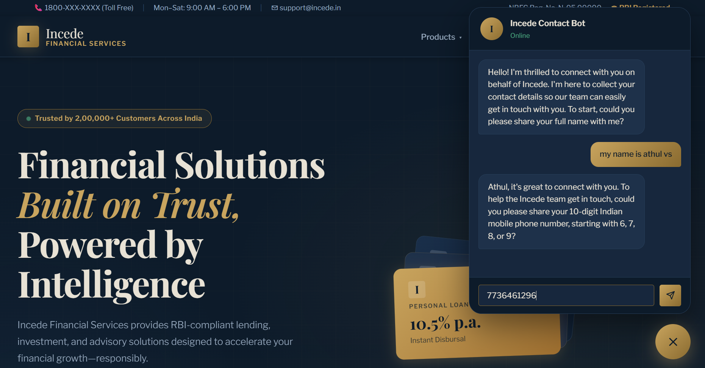
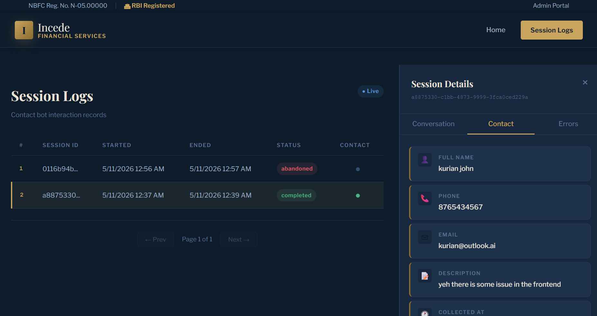

# Incede Contact Bot

A conversational contact-collection chatbot built with **LangGraph**, **LangChain**, and **Groq (Llama 4)**. It guides users through providing their name, phone number, email, and an optional description — validating each field via LLM tool calling — before saving the details to a SQLite database. The bot is served as a Flask web application.

---

## Features

- **Step-by-step collection** — collects name → phone → email → description in order, one field at a time
- **LLM-powered extraction** — uses structured output (JSON mode) to extract values from natural user input
- **LLM tool calling for validation** — the LLM decides which validation tool to invoke; Python executes it
- **All responses are LLM-generated** — no hardcoded bot strings; every reply is composed by the model using an instruction prompt
- **Off-topic detection** — redirects users who send unrelated questions back to the current field
- **SQLite persistence** — sessions, conversations, errors, and contact details are all stored in a local database
- **Session-based API** — Flask REST API with support for multiple concurrent chat sessions
- **Admin logs page** — paginated view of all sessions with collected contact details

---

## Project Structure

```
contact_bot/
├── app.py                  # Flask application — REST API endpoints and page routes
├── graph.py                # LangGraph workflow — builds and compiles the state machine
├── schema.py               # State definitions (TypedDict) and Pydantic extraction models
├── llm.py                  # Groq LLM setup — chat, structured output, and tool-calling clients
├── database.py             # SQLite CRUD — sessions, messages, errors, contact details
│
├── nodes/                  # One file per graph node
│   ├── __init__.py
│   ├── ask_name.py         # Greeting and name prompt node
│   ├── ask_phone.py        # Phone number prompt node
│   ├── ask_email.py        # Email address prompt node
│   ├── ask_description.py  # Optional description prompt node
│   ├── llm_node.py         # Central node — extraction, validation, and reply generation
│   └── complete_node.py    # Saves contact details and sends closing message
│
├── tools/                  # One file per validation tool
│   ├── __init__.py
│   ├── validate_name.py
│   ├── validate_phone.py
│   ├── validate_email.py
│   └── validate_description.py
│
├── static/
│   ├── css/style.css
│   └── js/
│       ├── chat.js
│       └── logs.js
│
└── templates/
    ├── index.html          # Chat UI
    └── logs.html           # Admin logs view
```

---

## How It Works

### Graph Flow


The graph collects fields in a fixed order — name → phone → email → description. After each user message, `llm_node` either advances to the next `ask_*` node (on success) or loops back to the same one (on failure). The `complete` node runs only when all four fields have been validated.

### `llm_node` — the core of the workflow

Each time the user sends a message, `llm_node` runs three steps:

1. **Off-topic detection** — if the input is a question that can't contain the expected field, the bot redirects politely.
2. **Extraction** — a structured-output LLM call parses the raw user input into a typed Pydantic model (e.g. `ExtractedPhone`).
3. **Validation via tool calling** — a second LLM call (with all four validation tools bound) decides which tool to invoke. Python executes that tool and gets back `{is_valid, reason}`.

If valid, the state advances to the next `ask_*` node. If invalid, `llm_node` generates an LLM reply explaining the problem and routes back to the current `ask_*` node.

### Validation Rules

| Field | Rules |
|---|---|
| **Name** | ≥ 2 chars, letters/spaces/hyphens/apostrophes only, no placeholders (`test`, `na`, etc.) |
| **Phone** | Exactly 10 digits, starts with 6/7/8/9 (Indian mobile), not all identical digits |
| **Email** | Standard `local@domain.tld` format, no spaces, domain label ≥ 3 chars, TLD 2–6 alpha chars |
| **Description** | Optional — empty/skip accepted; if provided, must be ≥ 5 characters |

---

## UI Screenshots

### Chat Interface



The main page presents a clean chat window where users interact with the bot step by step.

### Admin Logs



The logs page lists all sessions with their status, timestamps, and the contact details that were collected.

---

## Setup

### Prerequisites

- Python 3.10+
- A [Groq API key](https://console.groq.com)

### Installation

```bash
# Clone the repository
git clone <repo-url>
cd contact_bot

# Create and activate a virtual environment
python -m venv venv
source venv/bin/activate        # Windows: venv\Scripts\activate

# Install dependencies
pip install flask langgraph langchain-groq langchain-core groq python-dotenv
```

### Environment Variables

Create a `.env` file in the project root:

```env
GROQ_API_KEY=your_groq_api_key_here
```

### Running the App

```bash
python app.py
```

The app starts on `http://localhost:5000` by default.

- **Chat UI** → `http://localhost:5000/`
- **Admin logs** → `http://localhost:5000/logs`

The SQLite database (`incede_bot.db`) is created automatically on first run.

---

## API Reference

### `POST /api/session/start`
Starts a new chat session and returns the opening bot message.

**Response**
```json
{
  "session_id": "uuid-string",
  "message": "Hi! Welcome to Incede. I'm here to collect your contact details..."
}
```

---

### `POST /api/chat`
Sends a user message and returns the bot's reply.

**Request body**
```json
{
  "session_id": "uuid-string",
  "message": "My name is Rahul"
}
```

**Response**
```json
{
  "message": "Thanks, Rahul! Could you share your 10-digit mobile number?",
  "is_complete": false
}
```

---

### `GET /api/logs?page=1&per_page=20`
Returns a paginated list of sessions with contact details.

---

### `GET /api/session/<session_id>`
Returns the full conversation history and contact details for a session.

---

## Database Schema

| Table | Purpose |
|---|---|
| `sessions` | One row per chat session — tracks start/end time and whether contact was collected |
| `conversations` | Every message exchanged (role: `user` or `assistant`) |
| `contact_details` | Collected name, phone, email, and description per session |
| `errors` | Exception logs with traceback for debugging |

---

## Configuration

Key settings in `llm.py`:

| Setting | Value | Notes |
|---|---|---|
| `GROQ_MODEL` | `meta-llama/llama-4-scout-17b-16e-instruct` | Change to any Groq-supported model |
| Chat temperature | `0.7` | Higher for natural-sounding conversation |
| Extraction temperature | `0.0` | Deterministic for reliable JSON parsing |
| Validation temperature | `0.0` | Deterministic for reliable tool selection |

---

## Tech Stack

| Layer | Technology |
|---|---|
| LLM | Groq API — Llama 4 Scout |
| Orchestration | LangGraph |
| LLM Wrappers | LangChain / langchain-groq |
| Backend | Flask |
| Database | SQLite 3 |
| Frontend | Vanilla JS + CSS |